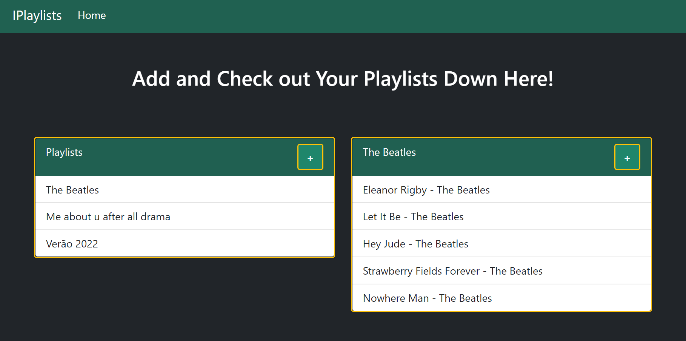

# projeto-ls
 Projeto realizado na disciplina de HTML, CSS, Bootstrap, JavaScript, Async Requests (Fetch API e JSON Server) e GitHub Pages.
 
 Integrantes: Gabriel Macaúbas Melo, Maria Eduarda de Almeida Vitorino e Louise Fernandes Caetano.
 
 

